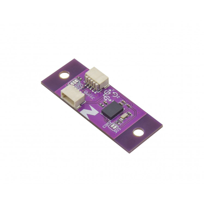

# Zio Qwiic 9DOF IMU BNO055

> This product can be available for purchase [here](https://www.smart-prototyping.com/Zio-9DOF-IMU-BNO055.html).

#### Description

The BNO055 is the ideal orientation solution with low overhead. What that means is that the computational cost is incredibly low for such a high-powered sensor. So, if you have a project consisting of peripherals that demand more computational power, the BNO055 is a great IMU to incorporate.

It provides Absolute Orientation by integrating 3 different sensors: a 3-axis 14-bit accelerometer,  3-axis 16-bit gyroscope, and a 3-axis magnetometer; and outputting the fused data in usable values. 

The following data can be collected by this sensor:

* **Quaternion Absolute Orientation** (4-point quaternion output that is as fast as it is sexy… that’s right, quaternions are sexy.)
* Euler Vector Absolute Orientation ( 3-axis orientation data based on a 360 sphere)
* Linear Acceleration in m/s^2
* Acceleration Vector  in m/s^2
* Magnetic Field Strength Vector
* Gravity Vector
* Angular Velocity Vector
* Temperature

We’ve made this board small enough to be suitable for use in advanced wearables and other space-sensitive projects. It’s been specifically designed for use in projects incorporating Qwiic, and so breaks out only the interrupt pin. However, if you’d like to use it in a non-Qwiic project, just use one of our Qwiic adapters, or you can just take a Qwiic cable, cut off one end, and solder the wire ends to the I2C pins of whatever you want.

Bosch’s smart 9DOF IMU will take raw sensor data and stream out meaningful results at up to 100Hz; you are saved the headache of sifting through algorithms with different levels of accuracy and complexity (and believe you me, they get pretty durned complex). And with the available libraries and example code, you can get it working with your project in a matter of minutes. There is a wide variety of applications in which this board can be used, such as AR, navigation, gaming, fitness, context awareness (think: robotics and mobile devices), and more.

> Note: As with all of the Version 1.0 Zio Qwiic boards, this board has been produced with the I2C pull-ups disconnected by default. If there's a significant length of wire between this board and your MCU, you'll need to solder closed the solder jumpers (labeled SDA, 3v3 and SCL) to connect the pull-up resistors to VCC.

#### Specification

* Accelerometer range: ±2g/±4g/±8g/±16g
* Magnetometer range: ±1300µT (x-, y-axis); ±2500µT (z-axis)
* Gyroscope range:  ±125°/s to ±2000°/s
* Voltage range: 1.7V - 3.6V
* IC: BNO055
* I2C address: 0x28,0x29 (Default: 0x28)
* Dimension with Mounting  Tab: 36.7x14.2 mm
* Dimension without Mounting  Tab: 24.9x14.2mm
* Weight: 1.2g (0.042oz)

#### Links

* [Bosch’s BNO055 Datasheet](https://www.smart-prototyping.com/image/data/NOA-RnD/101892%20BNO%20055/BST_BNO055_DS000_12.pdf)
* [Adafruit BNO055 Arduino Library and Unified Sensor Library](https://github.com/adafruit/Adafruit_BNO055)
* [Adafruit Sensor Library](https://github.com/adafruit/Adafruit_Sensor)
* [Eagle files](https://github.com/ZIOCC/Qwiic_BNO055)

> ###### About Zio
> Zio is a new line of open sourced, compact, and grid layout boards, fully integrated for Arduino and Qwiic ecosystem. Designed ideally for wearables, robotics, small-space limitations or other on the go projects. Check out other awesome Zio products [here](https://www.smart-prototyping.com/Zio).

> All Zio products are released under the [Creative Commons Attribution, Share-Alike License](https://creativecommons.org/licenses/by-sa/4.0/), and in accordance with the principles of the [Open Source Hardware Association's OSHW Statement of Principles 1.0 and OSHW Definition 1.0](https://www.oshwa.org/definition/).
